```mermaid
%%{init: {'theme': 'dark', 'flowchart': {'curve': 'linear'}}}%%
flowchart TB
    %% Audio Layer
    subgraph Phase1["Phase 1: Audio Pipeline"]
        A1[("Microphone Input")] --> CPAL[[CPAL]]
        CPAL -->|Raw Audio Stream| VAD[vad-rs]
        VAD -->|Speech Segments ≥150ms| Buffer[("Ring Buffer")]
        style Phase1 fill:#1a1a2e,stroke:#2d5b7a
    end

    %% STT Engine
    subgraph Phase2["Phase 2: STT"]
        Buffer --> Whisper[[whisper-rs]]
        Whisper -->|Convert to Mel Spectrogram| WhisperCore[("Whisper.cpp Model")]
        WhisperCore -->|Text Output| Sanitize[Sanitization Pipeline]
        style Phase2 fill:#16213e,stroke:#355c7d
    end

    %% LLM Brain
    subgraph Phase3["Phase 3: LLM"]
        Sanitize --> Prompt[Prompt Templating]
        Prompt --> Candle[[candle]]
        Candle -->|LoRA Adapters| Model[("Mistral/TinyLlama")]
        Model -->|Generated Text| Validate[Response Validation]
        style Phase3 fill:#0f3460,stroke:#4e4376
    end

    %% TTS Synthesis
    subgraph Phase4["Phase 4: TTS"]
        Validate --> Piper[[piper-rs]]
        Piper --> ONNX[[ONNX Runtime]]
        ONNX -->|Phoneme Dictionary| Voice[("Embedded Voice Model")]
        Voice -->|Audio Waveform| CPAL_Out[[CPAL Output]]
        style Phase4 fill:#2d033b,stroke:#6a0572
    end

    %% Optimization
    subgraph Phase5["Phase 5: Optimization"]
        CPAL_Out -.-> GPU{{GPU Acceleration}}
        GPU -->|CUDA/Metal| Whisper
        GPU -->|ONNX DirectML| ONNX
        Tokio[[Tokio Scheduler]] -->|Priority: STT > LLM > TTS| TaskQ[("Task Queue")]
        style Phase5 fill:#3a015c,stroke:#7b1e7a
    end

    %% Persona
    subgraph Phase6["Phase 6: Persona"]
        Emotion[Emotion Modulation] -->|Pitch/Speed| Piper
        LoRA[LoRA Injector] -->|Merge at Runtime| Model
        StressTest[("10-Minute Convo Test")] -->|Pass/Fail| Deploy[("Final Binary")]
        style Phase6 fill:#4b0082,stroke:#8a2be2
    end

    %% Hardware
    Hardware[[Hardware Layer]] -->|CPU: OpenBLAS<br>GPU: CUDA/Metal| Whisper
    Hardware -->|RAM ≥16GB| Model
    Hardware -->|Audio Drivers| CPAL

    %% Legend
    classDef tech fill:#2a2a2a,stroke:#666,color:#fff
    classDef phase fill:#1a1a1a,stroke:#444,color:#fff
    classDef data fill:#333,stroke:#666,color:#fff
```

# Project overview and plan

---

### **Tech Stack**
| **Component**          | **Technology**          |
|------------------------|-------------------------|
| **Audio I/O**          | CPAL + Symphonia        |
| **STT Engine**         | whisper-rs + candle     |
| **VAD**                | vad-rs                  |
| **LLM Integration**    | candle (Mistral/TinyLlama) |
| **TTS Synthesis**      | piper-rs + ONNX Runtime |
| **Async Runtime**      | Tokio                   |
| **Hardware Accel**     | CUDA/Metal (via candle) |

---

### **Roadmap**  
*(Phased Execution Order)*

#### **Phase 1: Audio Pipeline**  
- **Objective**: Reliable speech capture and streaming.  
- **Key Tasks**:  
  - Integrate CPAL for microphone input.  
  - Implement vad-rs for voice activity detection.  
  - Test latency (mic → buffer).  
- **Exit Condition**: System streams only speech segments (≥150ms).  

#### **Phase 2: Speech-to-Text**  
- **Objective**: Offline transcription.  
- **Key Tasks**:  
  - Load Whisper.cpp via whisper-rs.  
  - Convert audio buffers to Whisper-compatible format.  
  - Benchmark transcription speed.  
- **Exit Condition**: 30s audio transcribed in ≤8s (baseline hardware).  

#### **Phase 3: Reasoning Engine**  
- **Objective**: Offline LLM responses.  
- **Key Tasks**:  
  - Load Mistral/TinyLlama via candle.  
  - Connect STT output → LLM input.  
  - Validate response coherence.  
- **Exit Condition**: LLM answers test prompts offline.  

#### **Phase 4: Voice Synthesis**  
- **Objective**: Natural TTS output.  
- **Key Tasks**:  
  - Integrate Piper-rs with ONNX.  
  - Embed voice model and phoneme dictionary.  
  - Tune prosody parameters.  
- **Exit Condition**: TTS latency ≤2s (text → speech).  

#### **Phase 5: Optimization**  
- **Objective**: Real-time performance.  
- **Key Tasks**:  
  - Enable GPU acceleration (candle/ONNX).  
  - Prioritize Tokio tasks (STT > LLM > TTS).  
- **Exit Condition**: End-to-end latency ≤4s (mic → TTS).  

#### **Phase 6: Persona Finalization**  
- **Objective**: Character consistency.  
- **Key Tasks**:  
  - Inject LoRA adapters into LLM.  
  - Add emotional tone modulation (TTS).  
- **Exit Condition**: Passes 10-minute unscripted dialogue test.  

---

### **Dependency Flow**  
1. Phase 1 → Phase 2 (Audio → STT)  
2. Phase 2 → Phase 3 (STT → LLM)  
3. Phase 3 → Phase 4 (LLM → TTS)  
4. Phase 4 → Phase 5 (Baseline → Optimized)  
5. Phase 5 → Phase 6 (Optimized → Persona)  

---

